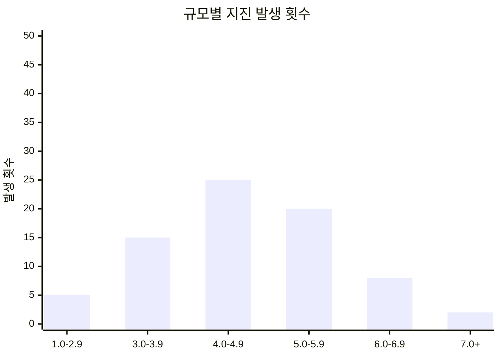
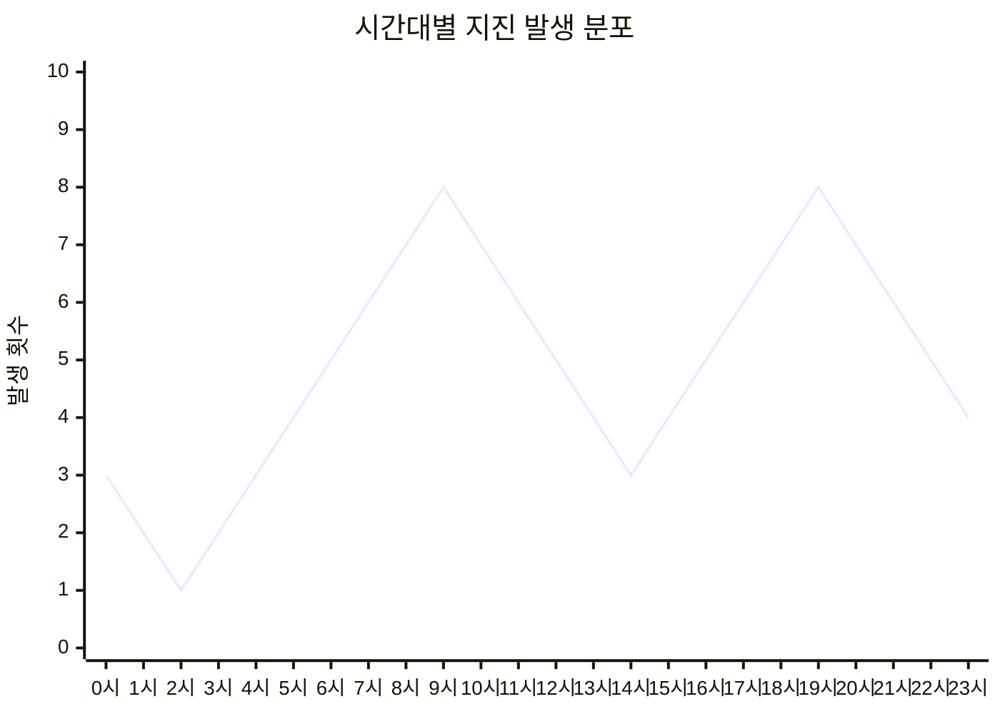
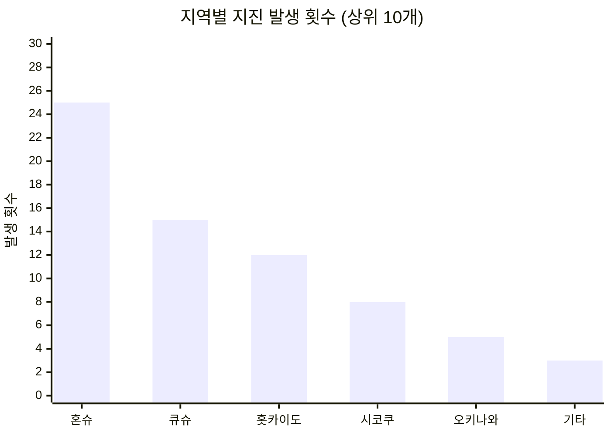
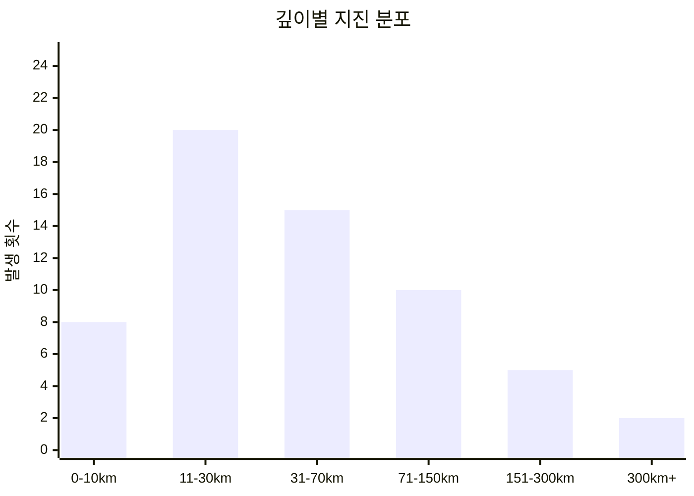

# 🌏 일본 지진 데이터 시각화

일본 기상청의 지진 데이터를 자동으로 수집하고 Mermaid 차트로 시각화하는 프로젝트입니다.

## 📊 실시간 지진 데이터 차트

### 규모별 지진 발생 횟수


### 시간대별 지진 발생 분포


### 지역별 지진 발생 횟수


### 깊이별 지진 분포


## 🚀 프로젝트 구조

```
earthquake/
├── .github/
│   └── workflows/
│       └── fetch-earthquake-data.yml    # GitHub Actions 워크플로우
├── scripts/
│   ├── fetch-earthquake-data.js         # 지진 데이터 수집 스크립트
│   └── generate-mermaid-charts.js       # Mermaid 차트 생성 스크립트
├── data/
│   └── latest.json                      # 최신 지진 데이터
├── charts/
│   ├── magnitude-chart.md               # 규모별 차트
│   ├── time-chart.md                    # 시간대별 차트
│   ├── region-chart.md                  # 지역별 차트
│   └── depth-chart.md                   # 깊이별 차트
├── index.html                           # GitHub Pages 메인 페이지
├── package.json                         # 프로젝트 설정
└── README.md                            # 프로젝트 설명
```

## 🔄 자동화 프로세스

1. **데이터 수집**: GitHub Actions가 매시간 일본 기상청 사이트에서 최신 지진 데이터를 크롤링
2. **데이터 처리**: 수집된 데이터를 JSON 형태로 정리하여 저장
3. **차트 생성**: Mermaid 형식의 차트를 자동으로 생성
4. **페이지 업데이트**: GitHub Pages를 통해 시각화 페이지 자동 업데이트

## 📈 데이터 소스

- **지진 목록**: [일본 기상청 지진 정보](https://www.data.jma.go.jp/multi/quake/index.html?lang=kr)
- **지진 상세**: [상세 정보 페이지](https://www.data.jma.go.jp/multi/quake/quake_detail.html?eventID=20250704141730&lang=kr)

## 🛠️ 기술 스택

- **데이터 수집**: Node.js, Axios, Cheerio
- **시각화**: Mermaid.js
- **자동화**: GitHub Actions
- **배포**: GitHub Pages
- **데이터 저장**: JSON 파일

## 🎯 주요 기능

- ✅ 실시간 지진 데이터 수집
- ✅ 규모별 지진 발생 통계
- ✅ 시간대별 지진 발생 패턴 분석
- ✅ 지역별 지진 발생 현황
- ✅ 깊이별 지진 분포 분석
- ✅ 반응형 웹 디자인
- ✅ 자동 업데이트 (매시간)

## 📱 사용 방법

1. GitHub Pages 사이트 방문
2. 실시간 차트 및 데이터 확인
3. 매시간 자동 업데이트되는 최신 정보 확인

## 📊 차트 업데이트 상태

> 🔄 **마지막 업데이트**: 차트는 매시간 자동으로 업데이트됩니다.
> 
> 📅 **데이터 기간**: 일본 기상청에서 제공하는 최신 지진 정보
> 
> 🎯 **정확도**: 일본 기상청 공식 데이터 기준

## 🤝 기여하기

이 프로젝트에 기여하고 싶다면:

1. 저장소 Fork
2. 새로운 브랜치 생성
3. 변경사항 커밋
4. Pull Request 생성

## 📝 라이선스

이 프로젝트는 MIT 라이선스를 따릅니다.

---

**⚠️ 주의사항**: 이 데이터는 정보 제공 목적으로만 사용되며, 실제 재해 대응 시에는 공식 기상청 정보를 확인하시기 바랍니다.