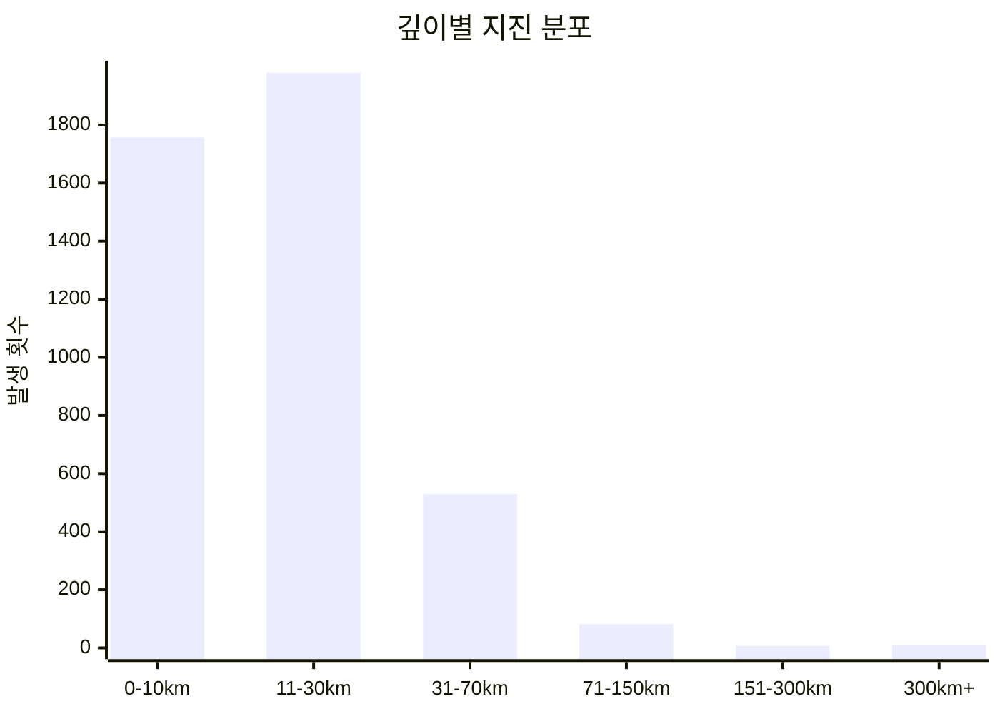

# 깊이별 지진 분포

```mermaid
xychart-beta
    title "깊이별 지진 분포"
    x-axis ["0-10km", "11-30km", "31-70km", "71-150km", "151-300km", "300km+"]
    y-axis "발생 횟수" 0 --> 1982
    bar [1757, 1980, 530, 82, 7, 9]
```

업데이트 시간: 2026-06-15 17:46:27
