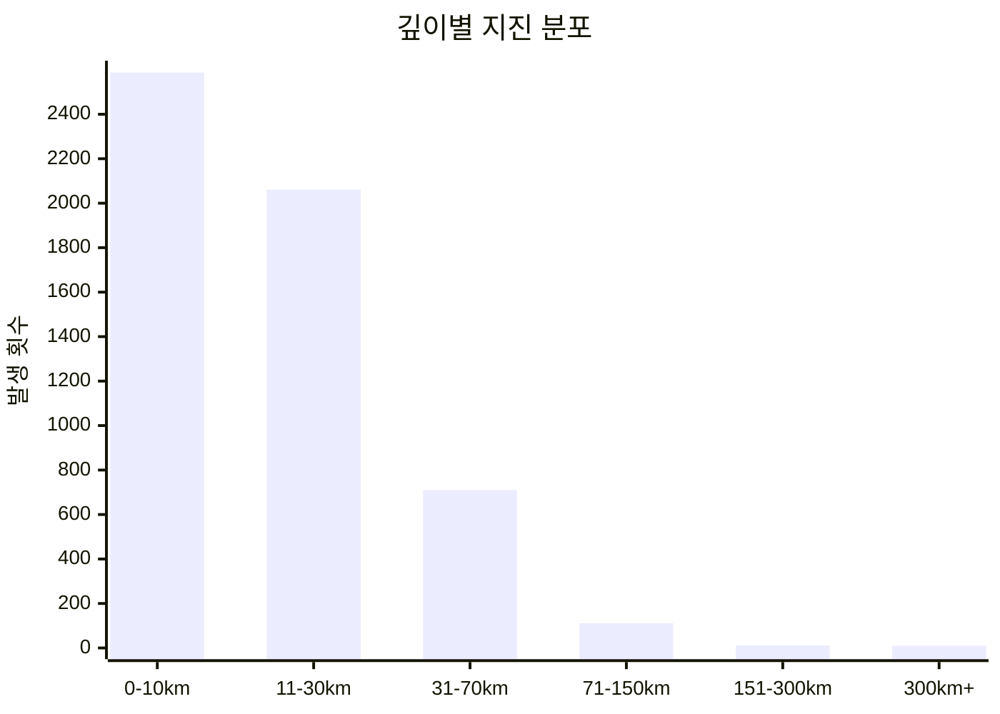

# 깊이별 지진 분포

```mermaid
xychart-beta
    title "깊이별 지진 분포"
    x-axis ["0-10km", "11-30km", "31-70km", "71-150km", "151-300km", "300km+"]
    y-axis "발생 횟수" 0 --> 2590
    bar [2588, 2061, 710, 111, 11, 10]
```

업데이트 시간: 2026-09-22 19:32:55
