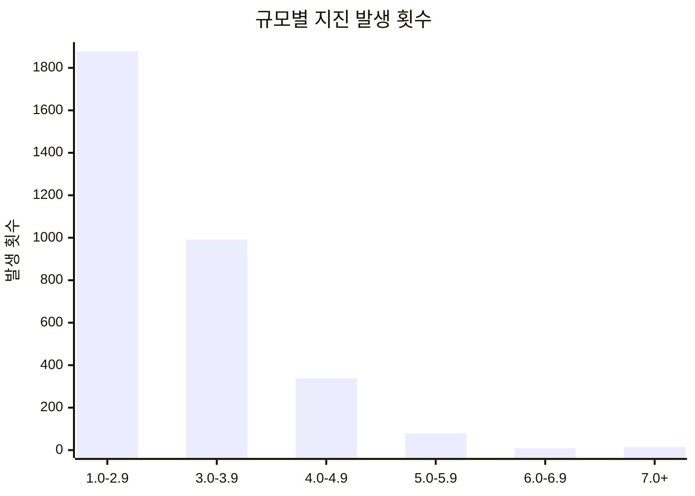

# 규모별 지진 발생 횟수

```mermaid
xychart-beta
    title "규모별 지진 발생 횟수"
    x-axis [1.0-2.9, 3.0-3.9, 4.0-4.9, 5.0-5.9, 6.0-6.9, 7.0+]
    y-axis "발생 횟수" 0 --> 1884
    bar [1879, 991, 338, 79, 9, 14]
```

업데이트 시간: 2026-01-02 06:07:14
