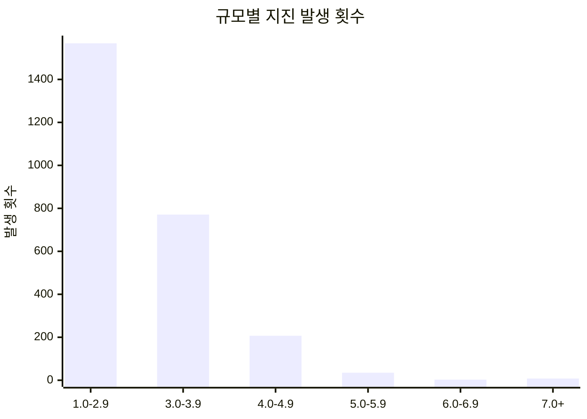

# 규모별 지진 발생 횟수

```mermaid
xychart-beta
    title "규모별 지진 발생 횟수"
    x-axis [1.0-2.9, 3.0-3.9, 4.0-4.9, 5.0-5.9, 6.0-6.9, 7.0+]
    y-axis "발생 횟수" 0 --> 1573
    bar [1568, 771, 207, 35, 3, 8]
```

업데이트 시간: 2025-09-17 17:04:04
