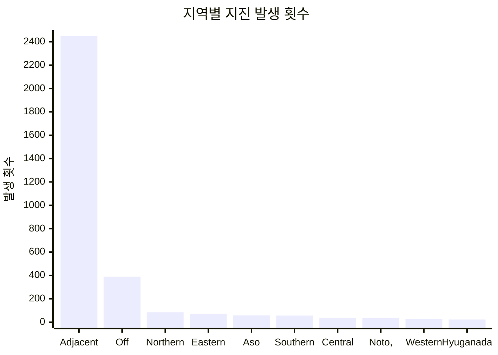

# 지역별 지진 발생 횟수 (상위 10개)

```mermaid
xychart-beta
    title "지역별 지진 발생 횟수"
    x-axis ["Adjacent", "Off", "Northern", "Eastern", "Aso", "Southern", "Central", "Noto,", "Western", "Hyuganada"]
    y-axis "발생 횟수" 0 --> 2451
    bar [2449, 389, 85, 72, 58, 57, 38, 35, 26, 23]
```

업데이트 시간: 2026-01-10 11:04:25
