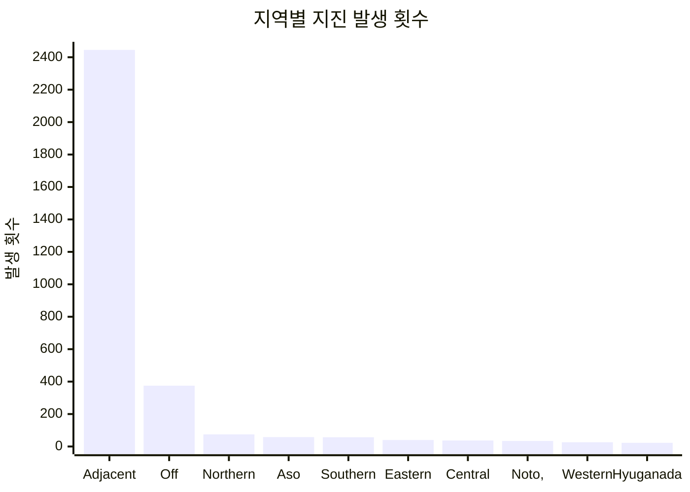

# 지역별 지진 발생 횟수 (상위 10개)

```mermaid
xychart-beta
    title "지역별 지진 발생 횟수"
    x-axis ["Adjacent", "Off", "Northern", "Aso", "Southern", "Eastern", "Central", "Noto,", "Western", "Hyuganada"]
    y-axis "발생 횟수" 0 --> 2447
    bar [2445, 375, 75, 58, 57, 40, 37, 34, 26, 23]
```

업데이트 시간: 2026-01-06 02:40:56
