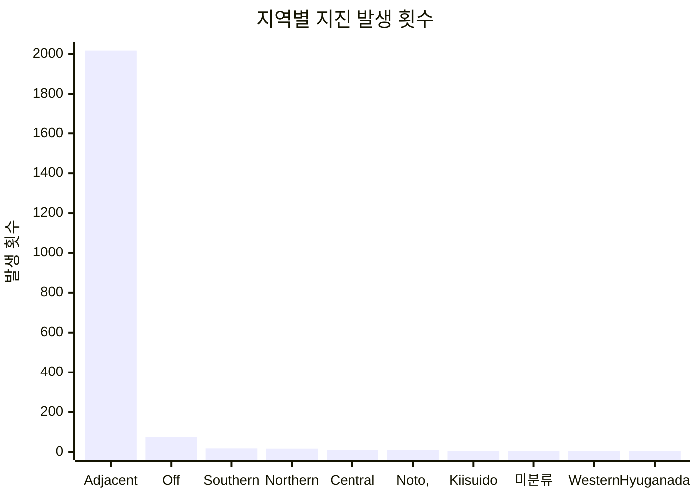

# 지역별 지진 발생 횟수 (상위 10개)

```mermaid
xychart-beta
    title "지역별 지진 발생 횟수"
    x-axis ["Adjacent", "Off", "Southern", "Northern", "Central", "Noto,", "Kiisuido", "미분류", "Western", "Hyuganada"]
    y-axis "발생 횟수" 0 --> 2019
    bar [2017, 76, 18, 17, 9, 9, 6, 6, 5, 5]
```

업데이트 시간: 2025-07-29 08:05:48
