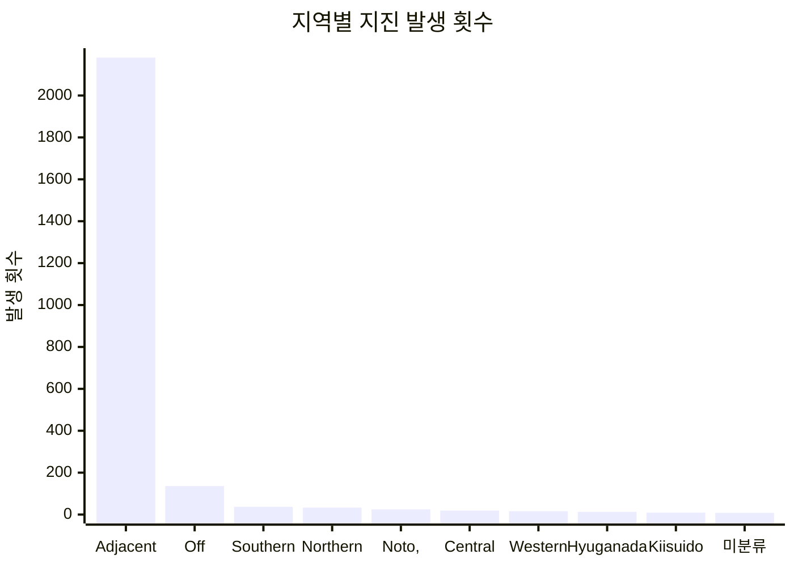

# 지역별 지진 발생 횟수 (상위 10개)

```mermaid
xychart-beta
    title "지역별 지진 발생 횟수"
    x-axis ["Adjacent", "Off", "Southern", "Northern", "Noto,", "Central", "Western", "Hyuganada", "Kiisuido", "미분류"]
    y-axis "발생 횟수" 0 --> 2183
    bar [2181, 136, 37, 33, 25, 19, 16, 13, 9, 8]
```

업데이트 시간: 2025-09-13 08:04:43
