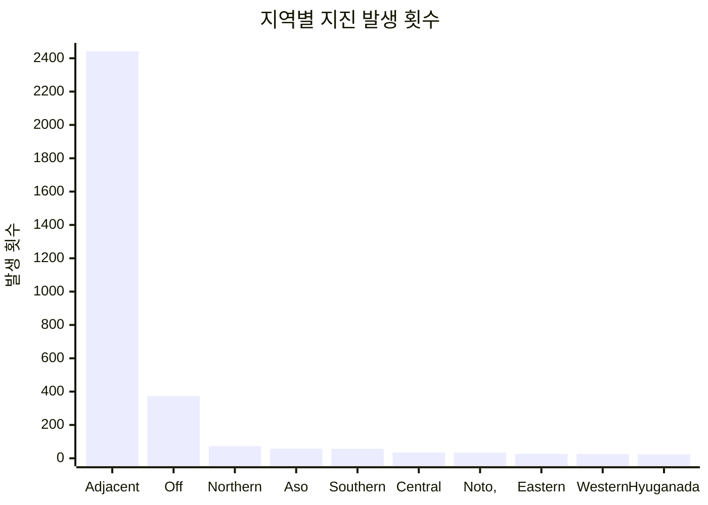

# 지역별 지진 발생 횟수 (상위 10개)

```mermaid
xychart-beta
    title "지역별 지진 발생 횟수"
    x-axis ["Adjacent", "Off", "Northern", "Aso", "Southern", "Central", "Noto,", "Eastern", "Western", "Hyuganada"]
    y-axis "발생 횟수" 0 --> 2444
    bar [2442, 373, 73, 58, 57, 35, 34, 27, 26, 23]
```

업데이트 시간: 2025-12-31 23:04:30
