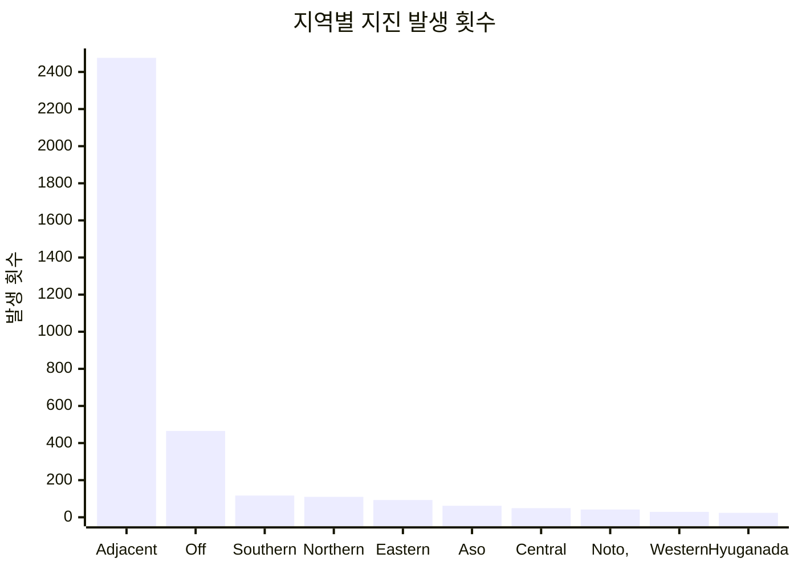

# 지역별 지진 발생 횟수 (상위 10개)

```mermaid
xychart-beta
    title "지역별 지진 발생 횟수"
    x-axis ["Adjacent", "Off", "Southern", "Northern", "Eastern", "Aso", "Central", "Noto,", "Western", "Hyuganada"]
    y-axis "발생 횟수" 0 --> 2478
    bar [2476, 465, 117, 110, 93, 62, 49, 42, 29, 24]
```

업데이트 시간: 2026-02-20 20:07:39
