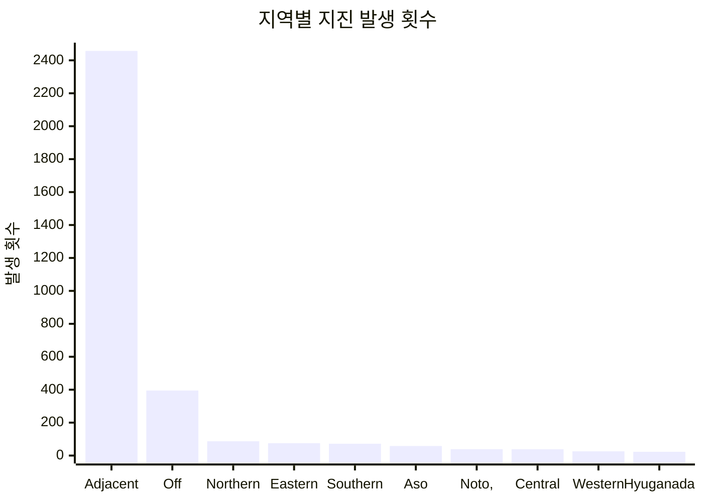

# 지역별 지진 발생 횟수 (상위 10개)

```mermaid
xychart-beta
    title "지역별 지진 발생 횟수"
    x-axis ["Adjacent", "Off", "Northern", "Eastern", "Southern", "Aso", "Noto,", "Central", "Western", "Hyuganada"]
    y-axis "발생 횟수" 0 --> 2459
    bar [2457, 395, 87, 75, 72, 58, 39, 38, 26, 23]
```

업데이트 시간: 2026-01-14 04:22:45
