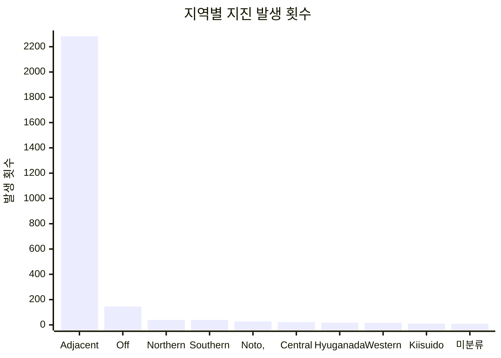

# 지역별 지진 발생 횟수 (상위 10개)

```mermaid
xychart-beta
    title "지역별 지진 발생 횟수"
    x-axis ["Adjacent", "Off", "Northern", "Southern", "Noto,", "Central", "Hyuganada", "Western", "Kiisuido", "미분류"]
    y-axis "발생 횟수" 0 --> 2284
    bar [2282, 145, 39, 39, 27, 22, 17, 16, 10, 9]
```

업데이트 시간: 2025-09-21 10:04:01
