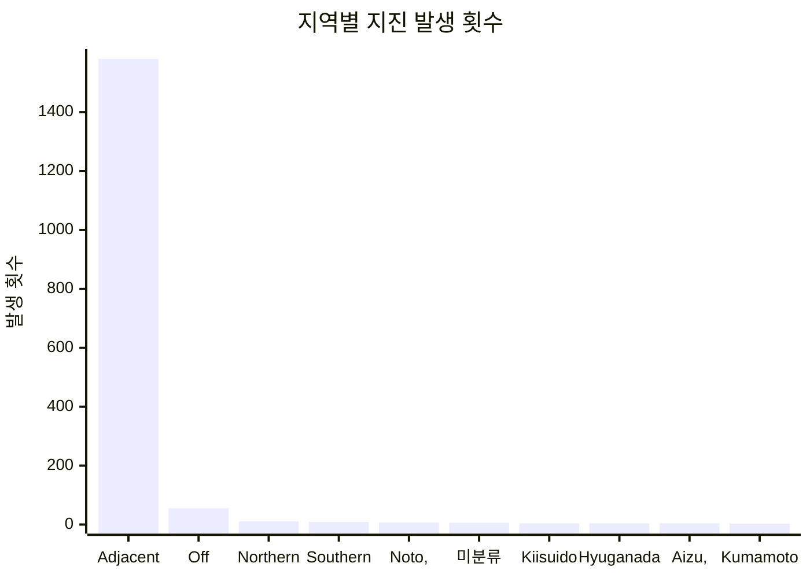

# 지역별 지진 발생 횟수 (상위 10개)

```mermaid
xychart-beta
    title "지역별 지진 발생 횟수"
    x-axis ["Adjacent", "Off", "Northern", "Southern", "Noto,", "미분류", "Kiisuido", "Hyuganada", "Aizu,", "Kumamoto"]
    y-axis "발생 횟수" 0 --> 1583
    bar [1581, 55, 11, 9, 7, 6, 4, 4, 4, 3]
```

업데이트 시간: 2025-07-10 13:14:09
