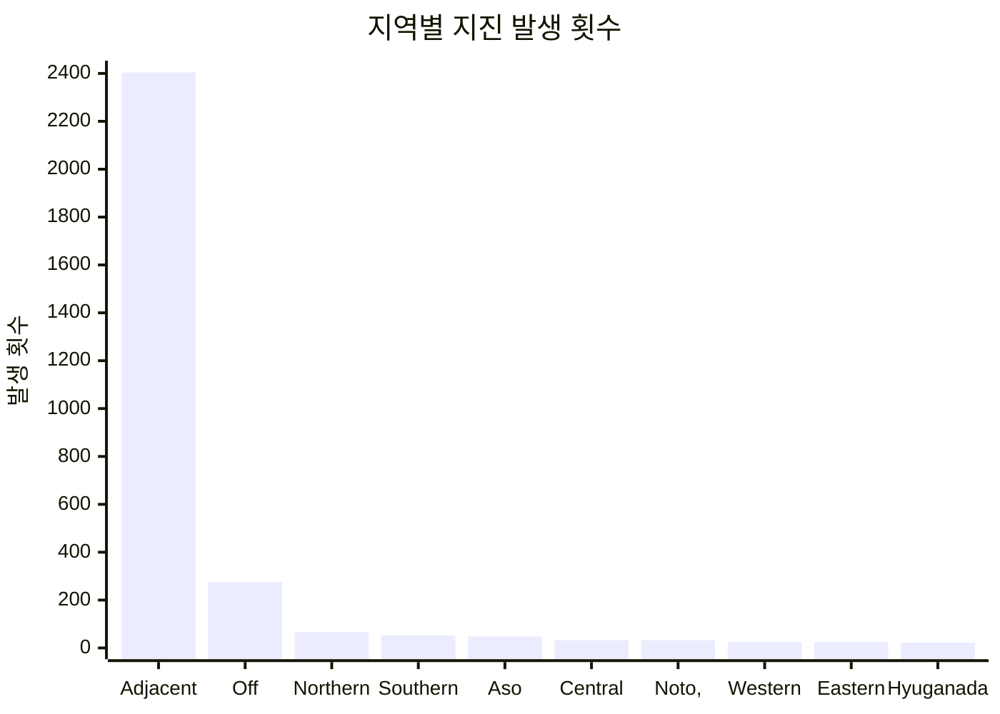

# 지역별 지진 발생 횟수 (상위 10개)

```mermaid
xychart-beta
    title "지역별 지진 발생 횟수"
    x-axis ["Adjacent", "Off", "Northern", "Southern", "Aso", "Central", "Noto,", "Western", "Eastern", "Hyuganada"]
    y-axis "발생 횟수" 0 --> 2406
    bar [2404, 275, 67, 52, 48, 32, 32, 25, 25, 22]
```

업데이트 시간: 2025-12-06 20:04:26
