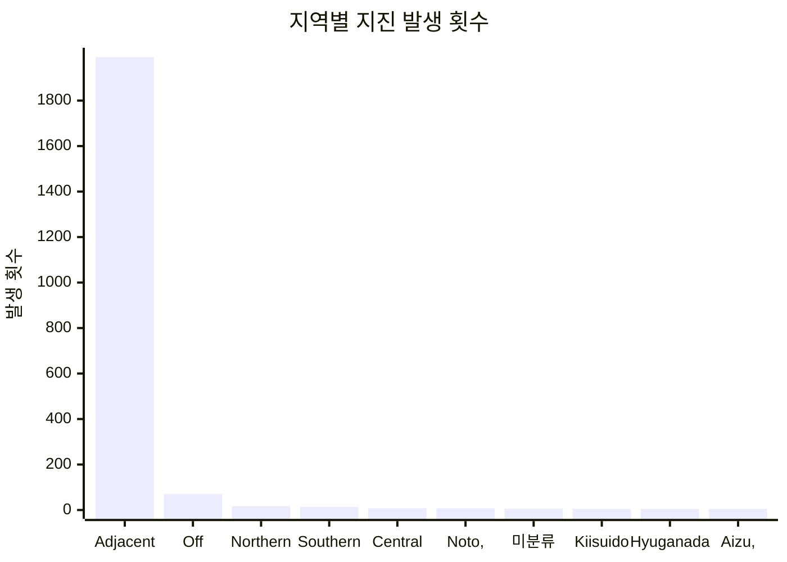

# 지역별 지진 발생 횟수 (상위 10개)

```mermaid
xychart-beta
    title "지역별 지진 발생 횟수"
    x-axis ["Adjacent", "Off", "Northern", "Southern", "Central", "Noto,", "미분류", "Kiisuido", "Hyuganada", "Aizu,"]
    y-axis "발생 횟수" 0 --> 1993
    bar [1991, 70, 17, 14, 8, 8, 6, 5, 5, 5]
```

업데이트 시간: 2025-07-23 22:04:06
