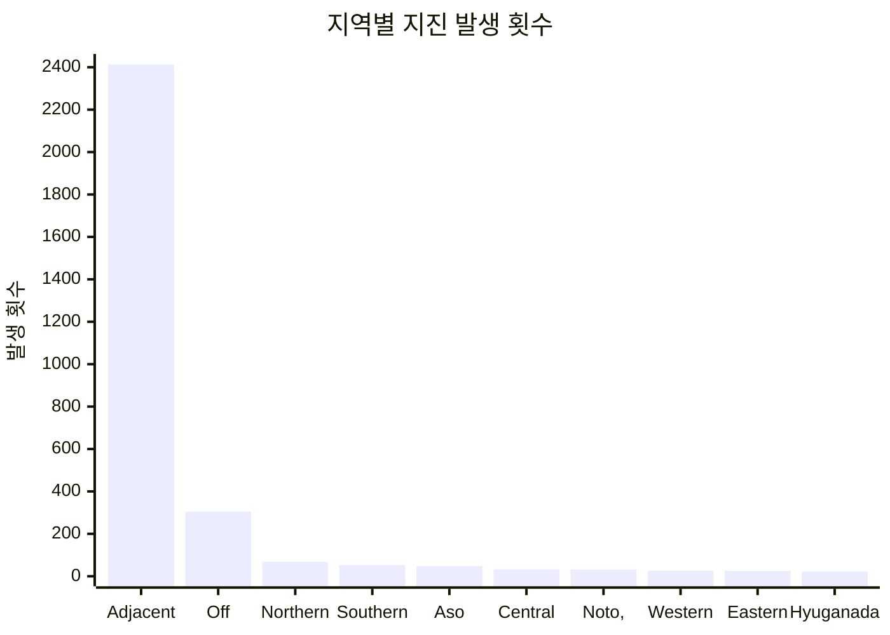

# 지역별 지진 발생 횟수 (상위 10개)

```mermaid
xychart-beta
    title "지역별 지진 발생 횟수"
    x-axis ["Adjacent", "Off", "Northern", "Southern", "Aso", "Central", "Noto,", "Western", "Eastern", "Hyuganada"]
    y-axis "발생 횟수" 0 --> 2415
    bar [2413, 305, 68, 53, 48, 33, 32, 26, 25, 23]
```

업데이트 시간: 2025-12-10 20:05:42
