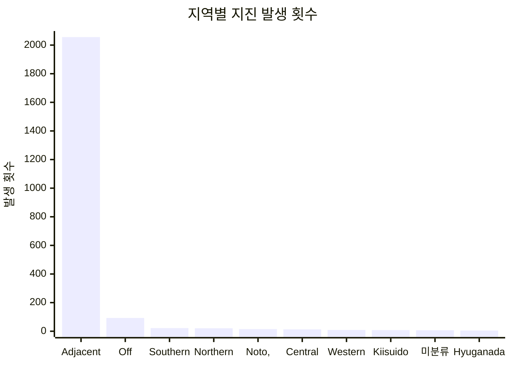

# 지역별 지진 발생 횟수 (상위 10개)

```mermaid
xychart-beta
    title "지역별 지진 발생 횟수"
    x-axis ["Adjacent", "Off", "Southern", "Northern", "Noto,", "Central", "Western", "Kiisuido", "미분류", "Hyuganada"]
    y-axis "발생 횟수" 0 --> 2058
    bar [2056, 93, 22, 21, 15, 13, 9, 8, 7, 5]
```

업데이트 시간: 2025-08-08 18:05:12
