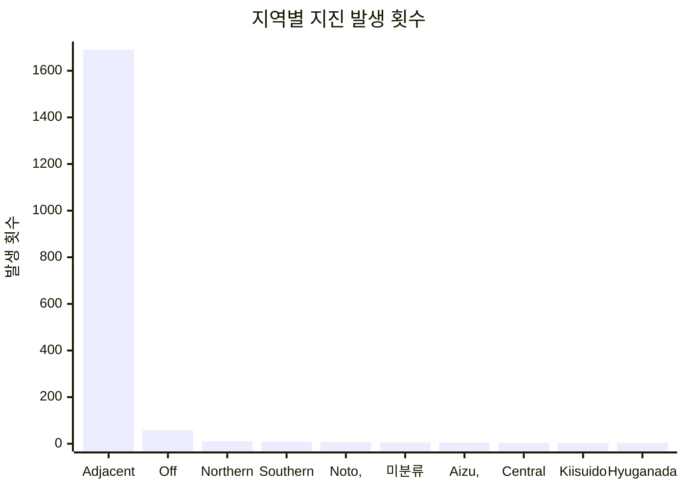

# 지역별 지진 발생 횟수 (상위 10개)

```mermaid
xychart-beta
    title "지역별 지진 발생 횟수"
    x-axis ["Adjacent", "Off", "Northern", "Southern", "Noto,", "미분류", "Aizu,", "Central", "Kiisuido", "Hyuganada"]
    y-axis "발생 횟수" 0 --> 1692
    bar [1690, 57, 11, 9, 7, 6, 5, 4, 4, 4]
```

업데이트 시간: 2025-07-11 20:04:19
