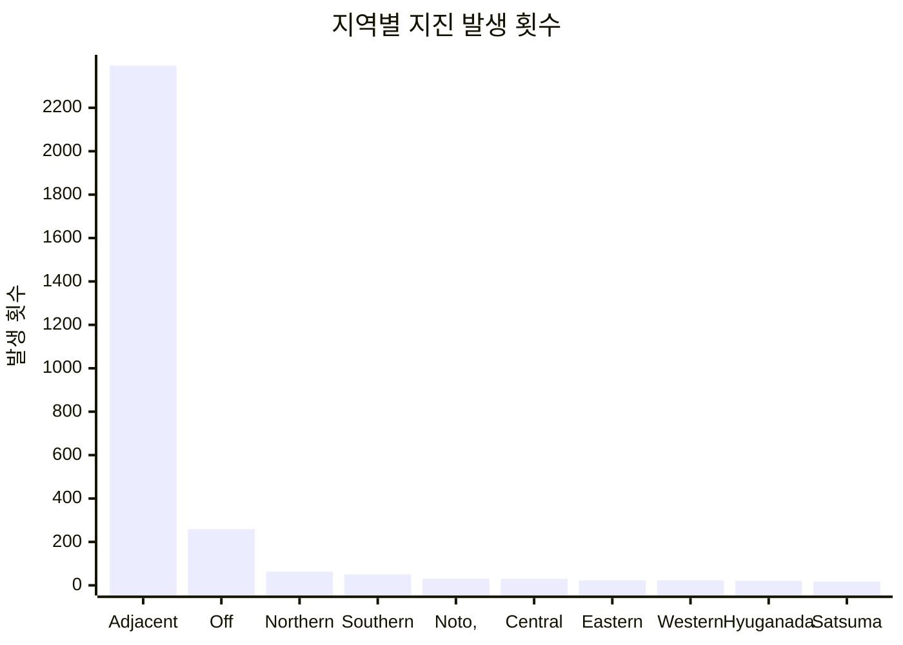

# 지역별 지진 발생 횟수 (상위 10개)

```mermaid
xychart-beta
    title "지역별 지진 발생 횟수"
    x-axis ["Adjacent", "Off", "Northern", "Southern", "Noto,", "Central", "Eastern", "Western", "Hyuganada", "Satsuma"]
    y-axis "발생 횟수" 0 --> 2397
    bar [2395, 259, 63, 50, 31, 30, 23, 23, 21, 18]
```

업데이트 시간: 2025-11-24 21:04:17
