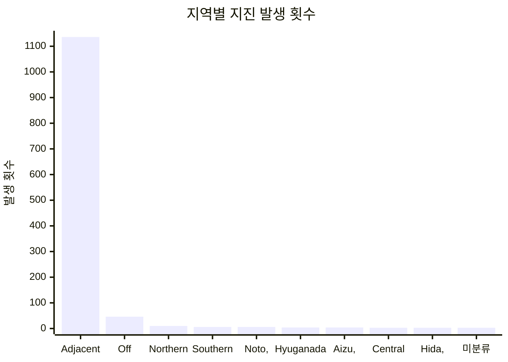

# 지역별 지진 발생 횟수 (상위 10개)

```mermaid
xychart-beta
    title "지역별 지진 발생 횟수"
    x-axis ["Adjacent", "Off", "Northern", "Southern", "Noto,", "Hyuganada", "Aizu,", "Central", "Hida,", "미분류"]
    y-axis "발생 횟수" 0 --> 1138
    bar [1136, 46, 10, 6, 6, 4, 4, 3, 3, 3]
```

업데이트 시간: 2025-07-04 16:04:40
