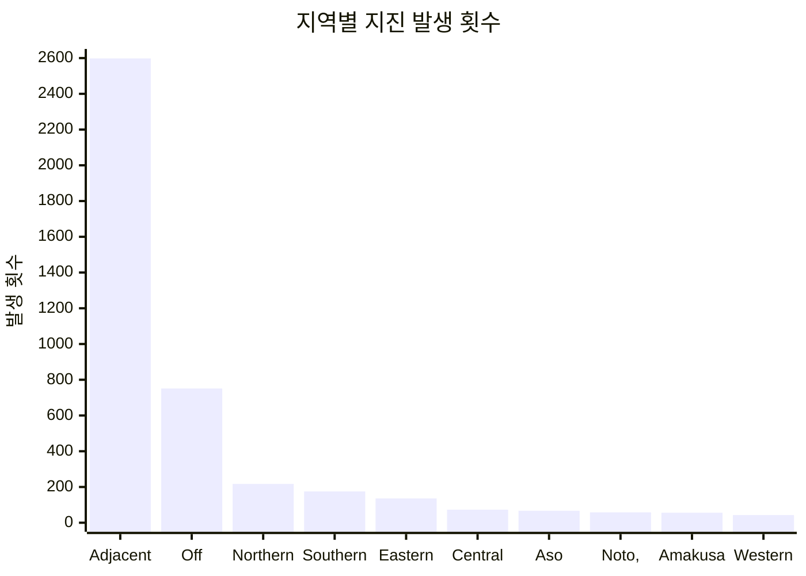

# 지역별 지진 발생 횟수 (상위 10개)

```mermaid
xychart-beta
    title "지역별 지진 발생 횟수"
    x-axis ["Adjacent", "Off", "Northern", "Southern", "Eastern", "Central", "Aso", "Noto,", "Amakusa", "Western"]
    y-axis "발생 횟수" 0 --> 2600
    bar [2598, 751, 217, 175, 136, 73, 67, 58, 56, 43]
```

업데이트 시간: 2026-07-21 17:13:52
