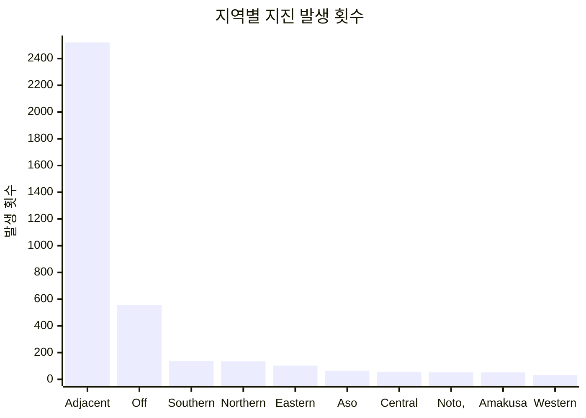

# 지역별 지진 발생 횟수 (상위 10개)

```mermaid
xychart-beta
    title "지역별 지진 발생 횟수"
    x-axis ["Adjacent", "Off", "Southern", "Northern", "Eastern", "Aso", "Central", "Noto,", "Amakusa", "Western"]
    y-axis "발생 횟수" 0 --> 2523
    bar [2521, 558, 136, 135, 103, 65, 56, 53, 52, 33]
```

업데이트 시간: 2026-04-09 04:49:08
