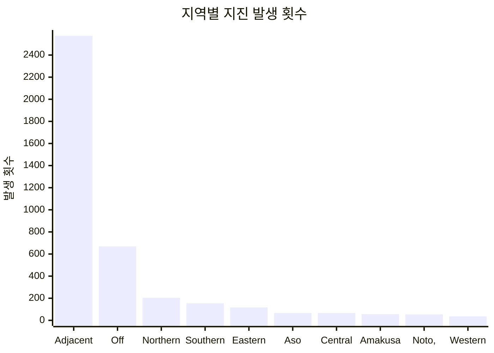

# 지역별 지진 발생 횟수 (상위 10개)

```mermaid
xychart-beta
    title "지역별 지진 발생 횟수"
    x-axis ["Adjacent", "Off", "Northern", "Southern", "Eastern", "Aso", "Central", "Amakusa", "Noto,", "Western"]
    y-axis "발생 횟수" 0 --> 2576
    bar [2574, 669, 204, 154, 117, 67, 66, 56, 54, 36]
```

업데이트 시간: 2026-06-06 00:44:24
