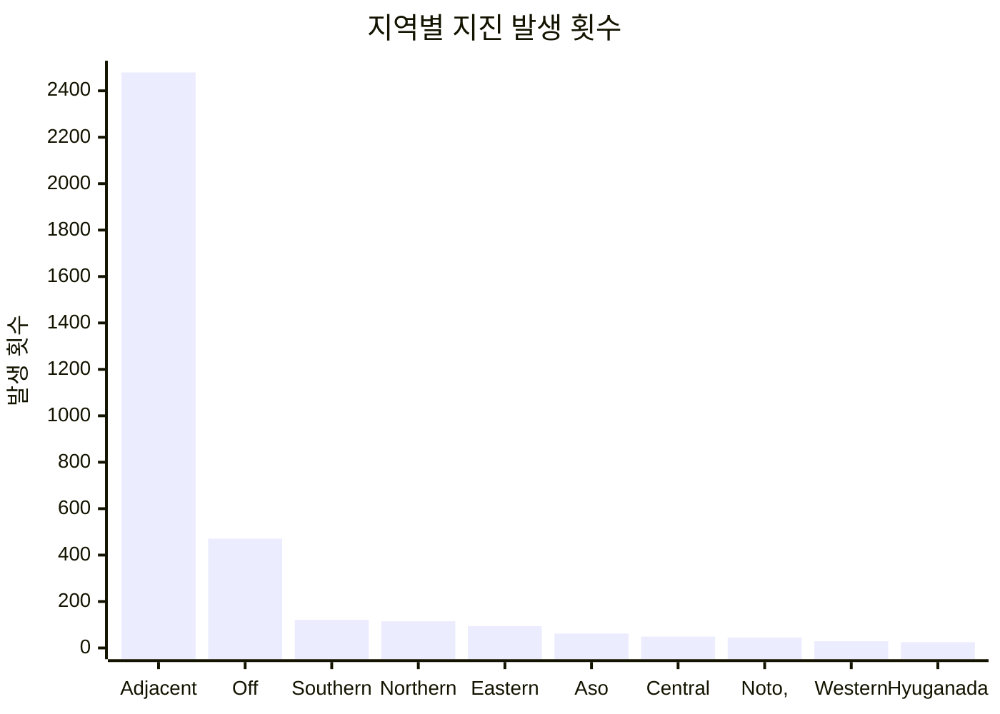

# 지역별 지진 발생 횟수 (상위 10개)

```mermaid
xychart-beta
    title "지역별 지진 발생 횟수"
    x-axis ["Adjacent", "Off", "Southern", "Northern", "Eastern", "Aso", "Central", "Noto,", "Western", "Hyuganada"]
    y-axis "발생 횟수" 0 --> 2481
    bar [2479, 471, 121, 115, 94, 62, 49, 45, 29, 25]
```

업데이트 시간: 2026-02-26 13:31:57
