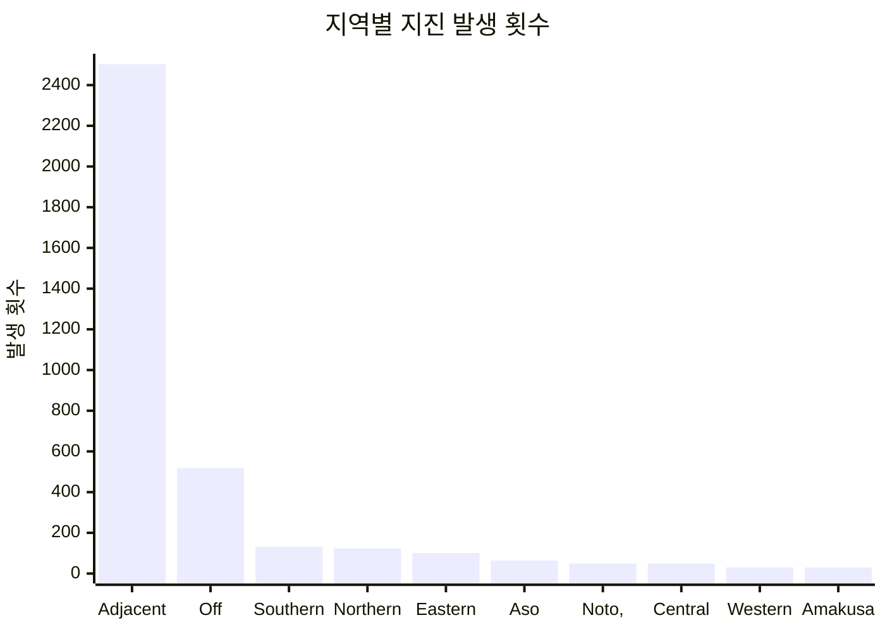

# 지역별 지진 발생 횟수 (상위 10개)

```mermaid
xychart-beta
    title "지역별 지진 발생 횟수"
    x-axis ["Adjacent", "Off", "Southern", "Northern", "Eastern", "Aso", "Noto,", "Central", "Western", "Amakusa"]
    y-axis "발생 횟수" 0 --> 2505
    bar [2503, 519, 131, 124, 101, 64, 49, 49, 31, 30]
```

업데이트 시간: 2026-03-20 15:17:00
