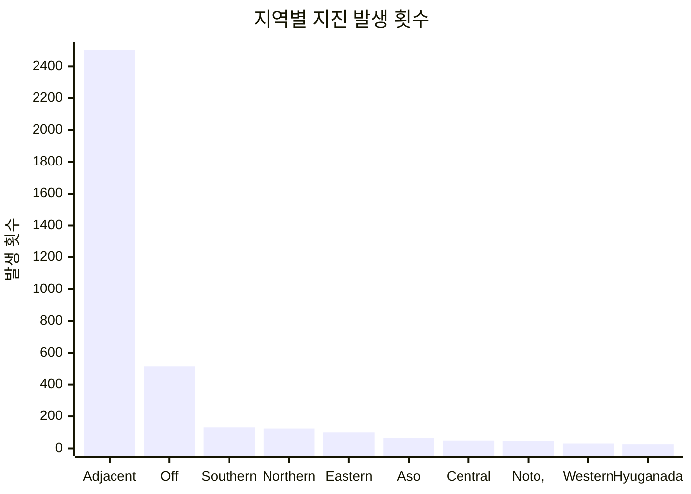

# 지역별 지진 발생 횟수 (상위 10개)

```mermaid
xychart-beta
    title "지역별 지진 발생 횟수"
    x-axis ["Adjacent", "Off", "Southern", "Northern", "Eastern", "Aso", "Central", "Noto,", "Western", "Hyuganada"]
    y-axis "발생 횟수" 0 --> 2504
    bar [2502, 516, 131, 124, 100, 64, 49, 48, 31, 26]
```

업데이트 시간: 2026-03-18 08:15:49
