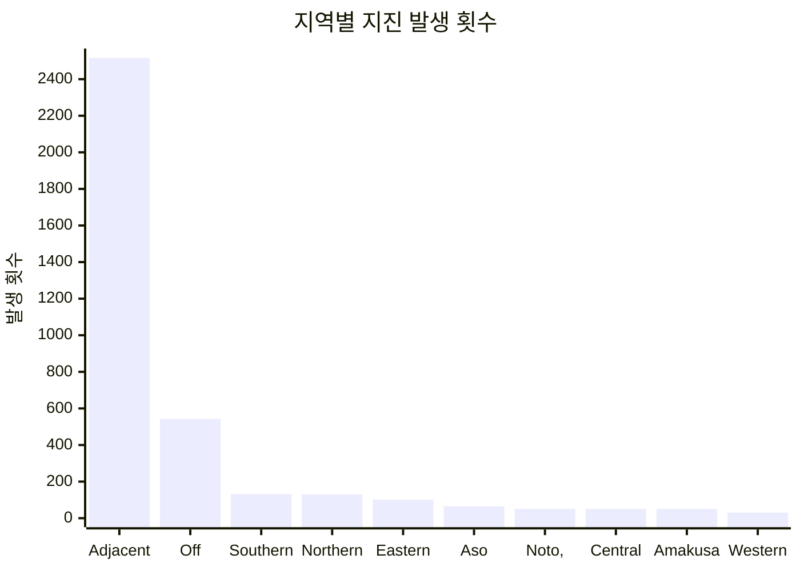

# 지역별 지진 발생 횟수 (상위 10개)

```mermaid
xychart-beta
    title "지역별 지진 발생 횟수"
    x-axis ["Adjacent", "Off", "Southern", "Northern", "Eastern", "Aso", "Noto,", "Central", "Amakusa", "Western"]
    y-axis "발생 횟수" 0 --> 2518
    bar [2516, 543, 131, 130, 102, 65, 51, 51, 51, 31]
```

업데이트 시간: 2026-03-31 14:33:24
