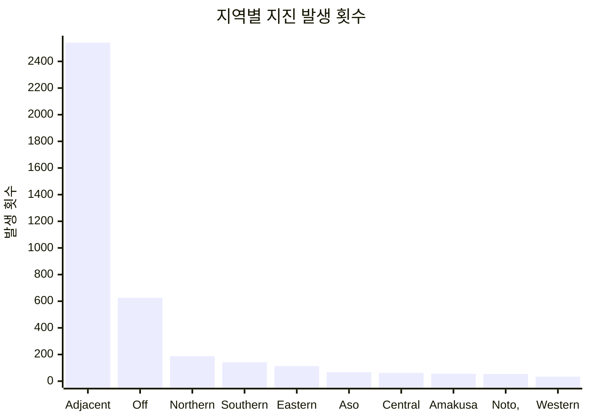

# 지역별 지진 발생 횟수 (상위 10개)

```mermaid
xychart-beta
    title "지역별 지진 발생 횟수"
    x-axis ["Adjacent", "Off", "Northern", "Southern", "Eastern", "Aso", "Central", "Amakusa", "Noto,", "Western"]
    y-axis "발생 횟수" 0 --> 2543
    bar [2541, 626, 188, 141, 113, 67, 62, 56, 54, 34]
```

업데이트 시간: 2026-05-09 13:32:19
