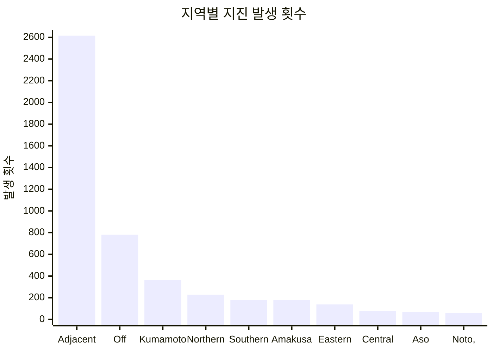

# 지역별 지진 발생 횟수 (상위 10개)

```mermaid
xychart-beta
    title "지역별 지진 발생 횟수"
    x-axis ["Adjacent", "Off", "Kumamoto", "Northern", "Southern", "Amakusa", "Eastern", "Central", "Aso", "Noto,"]
    y-axis "발생 횟수" 0 --> 2617
    bar [2615, 781, 362, 228, 178, 177, 139, 77, 68, 60]
```

업데이트 시간: 2026-08-10 07:24:02
