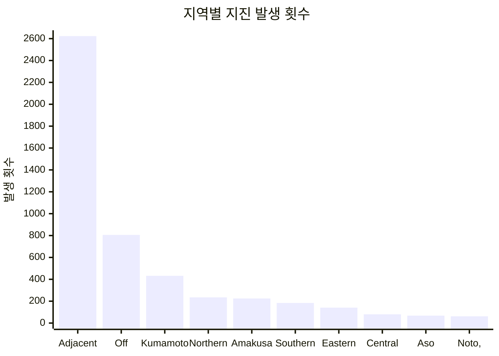

# 지역별 지진 발생 횟수 (상위 10개)

```mermaid
xychart-beta
    title "지역별 지진 발생 횟수"
    x-axis ["Adjacent", "Off", "Kumamoto", "Northern", "Amakusa", "Southern", "Eastern", "Central", "Aso", "Noto,"]
    y-axis "발생 횟수" 0 --> 2625
    bar [2623, 806, 432, 235, 225, 184, 141, 80, 68, 62]
```

업데이트 시간: 2026-08-25 21:23:42
