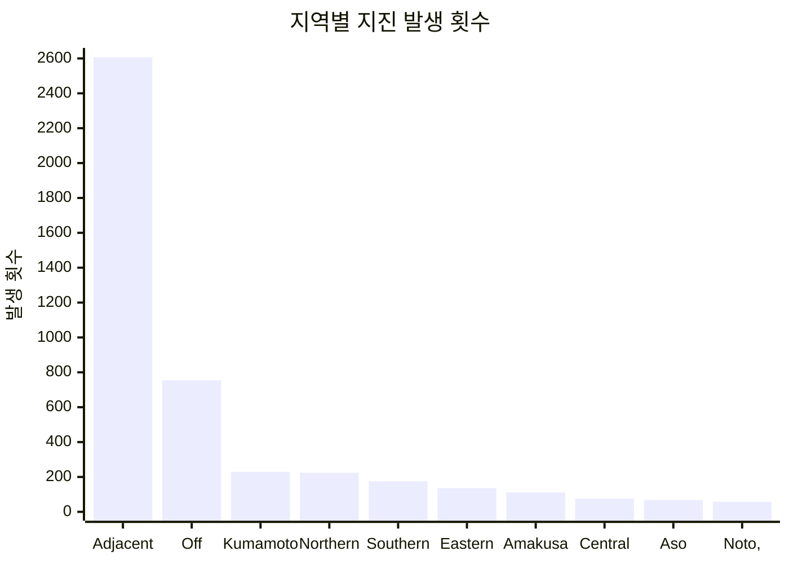

# 지역별 지진 발생 횟수 (상위 10개)

```mermaid
xychart-beta
    title "지역별 지진 발생 횟수"
    x-axis ["Adjacent", "Off", "Kumamoto", "Northern", "Southern", "Eastern", "Amakusa", "Central", "Aso", "Noto,"]
    y-axis "발생 횟수" 0 --> 2609
    bar [2607, 754, 229, 224, 175, 136, 111, 76, 68, 58]
```

업데이트 시간: 2026-07-30 03:53:38
