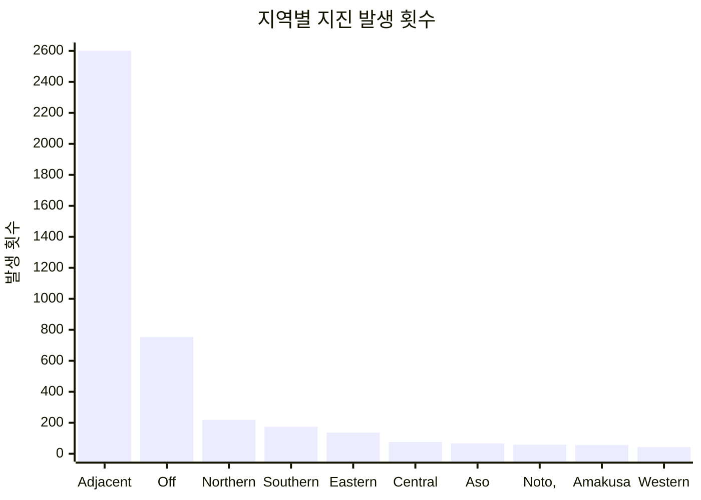

# 지역별 지진 발생 횟수 (상위 10개)

```mermaid
xychart-beta
    title "지역별 지진 발생 횟수"
    x-axis ["Adjacent", "Off", "Northern", "Southern", "Eastern", "Central", "Aso", "Noto,", "Amakusa", "Western"]
    y-axis "발생 횟수" 0 --> 2603
    bar [2601, 753, 219, 175, 136, 76, 67, 58, 56, 43]
```

업데이트 시간: 2026-07-25 08:58:18
