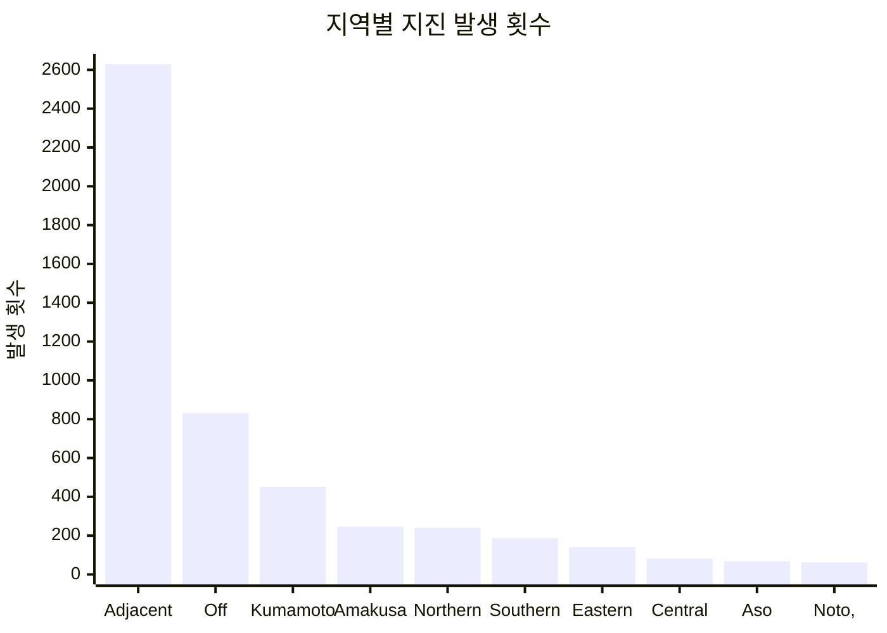

# 지역별 지진 발생 횟수 (상위 10개)

```mermaid
xychart-beta
    title "지역별 지진 발생 횟수"
    x-axis ["Adjacent", "Off", "Kumamoto", "Amakusa", "Northern", "Southern", "Eastern", "Central", "Aso", "Noto,"]
    y-axis "발생 횟수" 0 --> 2631
    bar [2629, 831, 452, 247, 240, 187, 141, 81, 68, 62]
```

업데이트 시간: 2026-09-09 07:51:16
