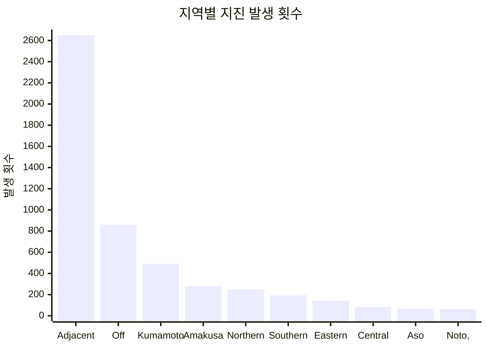

# 지역별 지진 발생 횟수 (상위 10개)

```mermaid
xychart-beta
    title "지역별 지진 발생 횟수"
    x-axis ["Adjacent", "Off", "Kumamoto", "Amakusa", "Northern", "Southern", "Eastern", "Central", "Aso", "Noto,"]
    y-axis "발생 횟수" 0 --> 2651
    bar [2649, 861, 489, 278, 249, 196, 143, 83, 68, 63]
```

업데이트 시간: 2026-10-06 17:51:56
