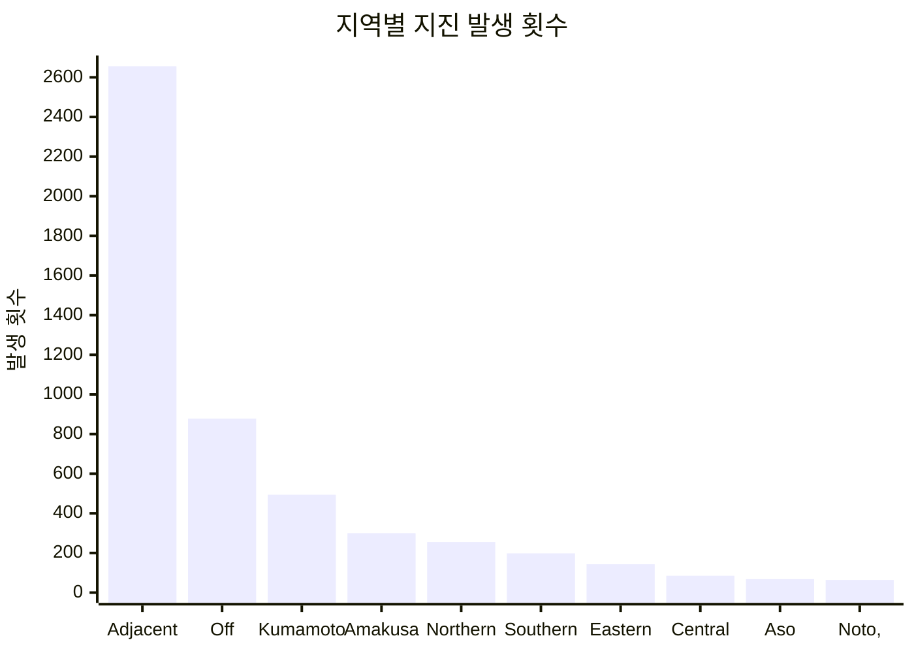

# 지역별 지진 발생 횟수 (상위 10개)

```mermaid
xychart-beta
    title "지역별 지진 발생 횟수"
    x-axis ["Adjacent", "Off", "Kumamoto", "Amakusa", "Northern", "Southern", "Eastern", "Central", "Aso", "Noto,"]
    y-axis "발생 횟수" 0 --> 2658
    bar [2656, 878, 494, 300, 255, 198, 143, 85, 68, 64]
```

업데이트 시간: 2026-10-20 07:05:44
