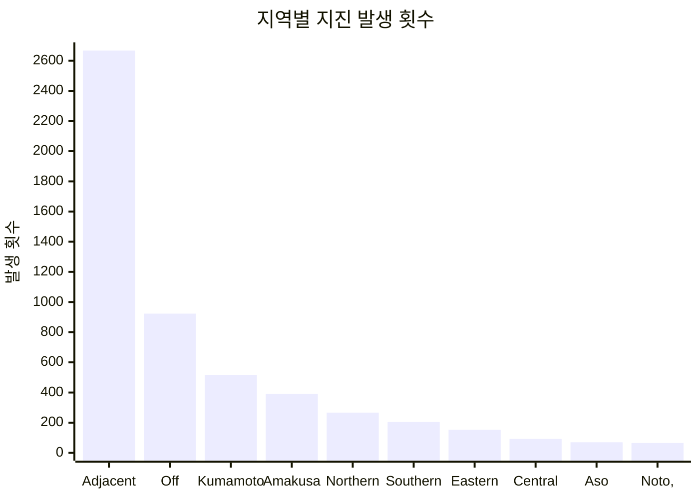

# 지역별 지진 발생 횟수 (상위 10개)

```mermaid
xychart-beta
    title "지역별 지진 발생 횟수"
    x-axis ["Adjacent", "Off", "Kumamoto", "Amakusa", "Northern", "Southern", "Eastern", "Central", "Aso", "Noto,"]
    y-axis "발생 횟수" 0 --> 2669
    bar [2667, 923, 517, 392, 267, 204, 153, 92, 70, 65]
```

업데이트 시간: 2026-11-20 08:20:57
