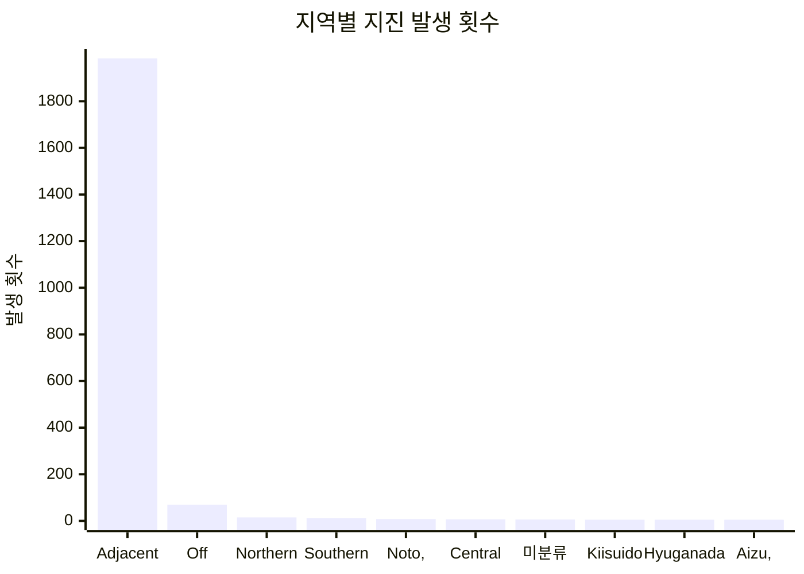

# 지역별 지진 발생 횟수 (상위 10개)

```mermaid
xychart-beta
    title "지역별 지진 발생 횟수"
    x-axis ["Adjacent", "Off", "Northern", "Southern", "Noto,", "Central", "미분류", "Kiisuido", "Hyuganada", "Aizu,"]
    y-axis "발생 횟수" 0 --> 1986
    bar [1984, 69, 15, 12, 8, 7, 6, 5, 5, 5]
```

업데이트 시간: 2025-07-21 19:05:09
