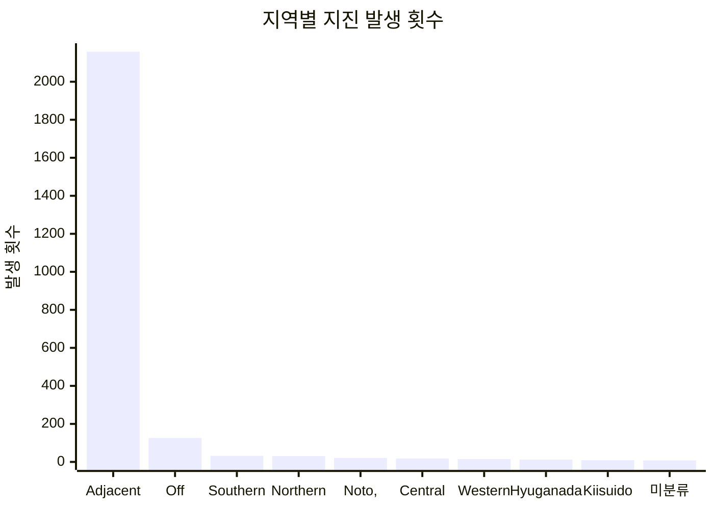

# 지역별 지진 발생 횟수 (상위 10개)

```mermaid
xychart-beta
    title "지역별 지진 발생 횟수"
    x-axis ["Adjacent", "Off", "Southern", "Northern", "Noto,", "Central", "Western", "Hyuganada", "Kiisuido", "미분류"]
    y-axis "발생 횟수" 0 --> 2160
    bar [2158, 126, 32, 31, 21, 18, 15, 12, 9, 8]
```

업데이트 시간: 2025-09-06 13:06:19
