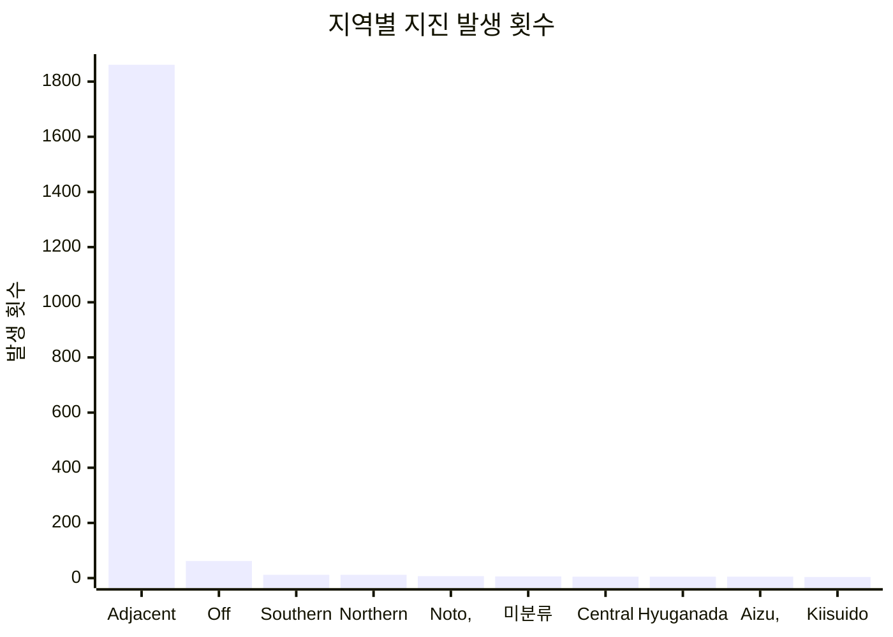

# 지역별 지진 발생 횟수 (상위 10개)

```mermaid
xychart-beta
    title "지역별 지진 발생 횟수"
    x-axis ["Adjacent", "Off", "Southern", "Northern", "Noto,", "미분류", "Central", "Hyuganada", "Aizu,", "Kiisuido"]
    y-axis "발생 횟수" 0 --> 1863
    bar [1861, 62, 12, 12, 7, 6, 5, 5, 5, 4]
```

업데이트 시간: 2025-07-15 14:04:45
