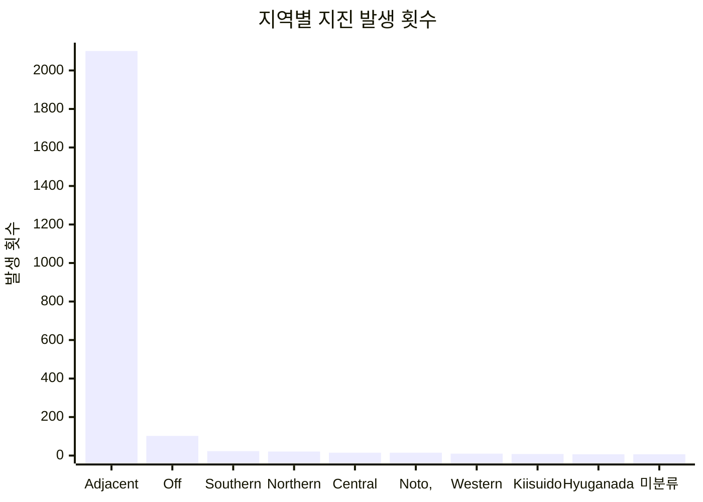

# 지역별 지진 발생 횟수 (상위 10개)

```mermaid
xychart-beta
    title "지역별 지진 발생 횟수"
    x-axis ["Adjacent", "Off", "Southern", "Northern", "Central", "Noto,", "Western", "Kiisuido", "Hyuganada", "미분류"]
    y-axis "발생 횟수" 0 --> 2103
    bar [2101, 102, 23, 21, 15, 15, 10, 8, 7, 7]
```

업데이트 시간: 2025-08-15 06:05:37
