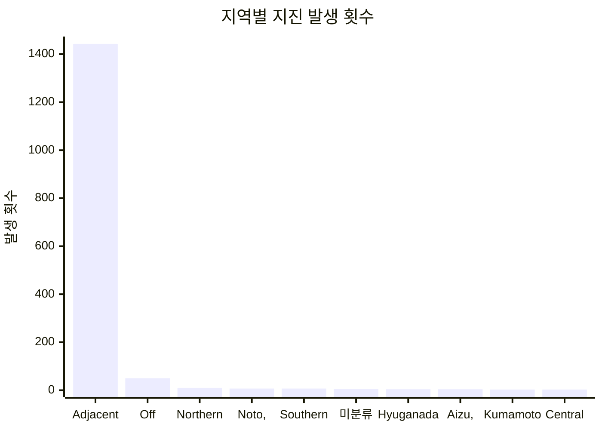

# 지역별 지진 발생 횟수 (상위 10개)

```mermaid
xychart-beta
    title "지역별 지진 발생 횟수"
    x-axis ["Adjacent", "Off", "Northern", "Noto,", "Southern", "미분류", "Hyuganada", "Aizu,", "Kumamoto", "Central"]
    y-axis "발생 횟수" 0 --> 1445
    bar [1443, 50, 10, 7, 7, 5, 4, 4, 3, 3]
```

업데이트 시간: 2025-07-07 04:28:24
