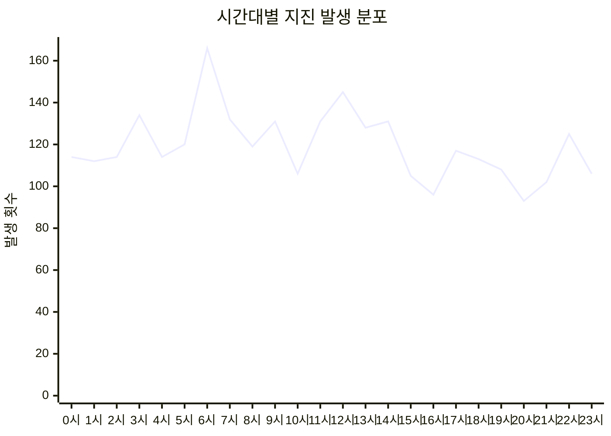

# 시간대별 지진 발생 분포

```mermaid
xychart-beta
    title "시간대별 지진 발생 분포"
    x-axis ["0시", "1시", "2시", "3시", "4시", "5시", "6시", "7시", "8시", "9시", "10시", "11시", "12시", "13시", "14시", "15시", "16시", "17시", "18시", "19시", "20시", "21시", "22시", "23시"]
    y-axis "발생 횟수" 0 --> 168
    line [114, 112, 114, 134, 114, 120, 166, 132, 119, 131, 106, 131, 145, 128, 131, 105, 96, 117, 113, 108, 93, 102, 125, 106]
```

업데이트 시간: 2025-10-26 18:05:32
