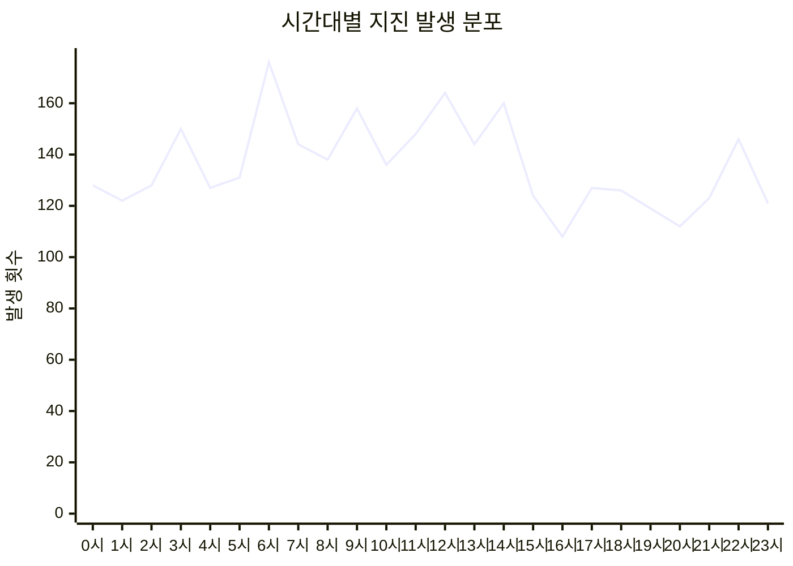

# 시간대별 지진 발생 분포

```mermaid
xychart-beta
    title "시간대별 지진 발생 분포"
    x-axis ["0시", "1시", "2시", "3시", "4시", "5시", "6시", "7시", "8시", "9시", "10시", "11시", "12시", "13시", "14시", "15시", "16시", "17시", "18시", "19시", "20시", "21시", "22시", "23시"]
    y-axis "발생 횟수" 0 --> 178
    line [128, 122, 128, 150, 127, 131, 176, 144, 138, 158, 136, 148, 164, 144, 160, 124, 108, 127, 126, 119, 112, 123, 146, 121]
```

업데이트 시간: 2025-12-20 22:04:10
