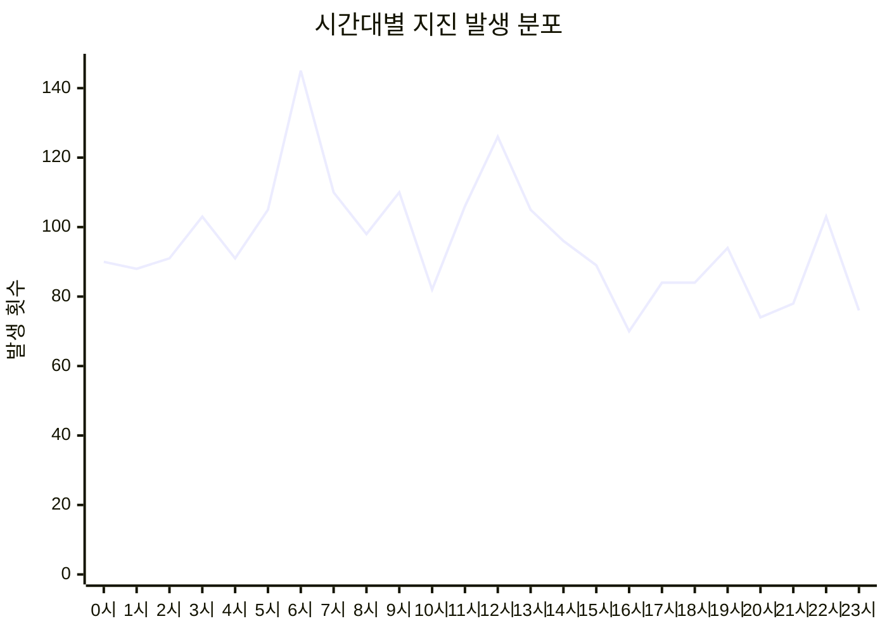

# 시간대별 지진 발생 분포

```mermaid
xychart-beta
    title "시간대별 지진 발생 분포"
    x-axis ["0시", "1시", "2시", "3시", "4시", "5시", "6시", "7시", "8시", "9시", "10시", "11시", "12시", "13시", "14시", "15시", "16시", "17시", "18시", "19시", "20시", "21시", "22시", "23시"]
    y-axis "발생 횟수" 0 --> 147
    line [90, 88, 91, 103, 91, 105, 145, 110, 98, 110, 82, 106, 126, 105, 96, 89, 70, 84, 84, 94, 74, 78, 103, 76]
```

업데이트 시간: 2025-08-09 12:06:15
