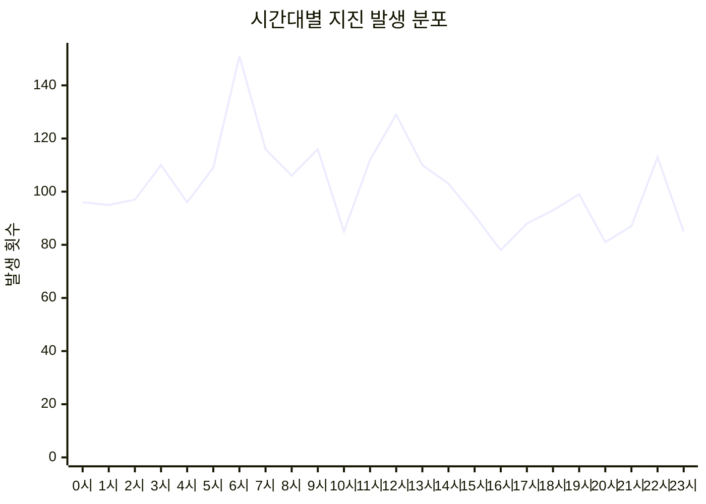

# 시간대별 지진 발생 분포

```mermaid
xychart-beta
    title "시간대별 지진 발생 분포"
    x-axis ["0시", "1시", "2시", "3시", "4시", "5시", "6시", "7시", "8시", "9시", "10시", "11시", "12시", "13시", "14시", "15시", "16시", "17시", "18시", "19시", "20시", "21시", "22시", "23시"]
    y-axis "발생 횟수" 0 --> 153
    line [96, 95, 97, 110, 96, 109, 151, 116, 106, 116, 85, 112, 129, 110, 103, 91, 78, 88, 93, 99, 81, 87, 113, 85]
```

업데이트 시간: 2025-08-28 03:18:14
