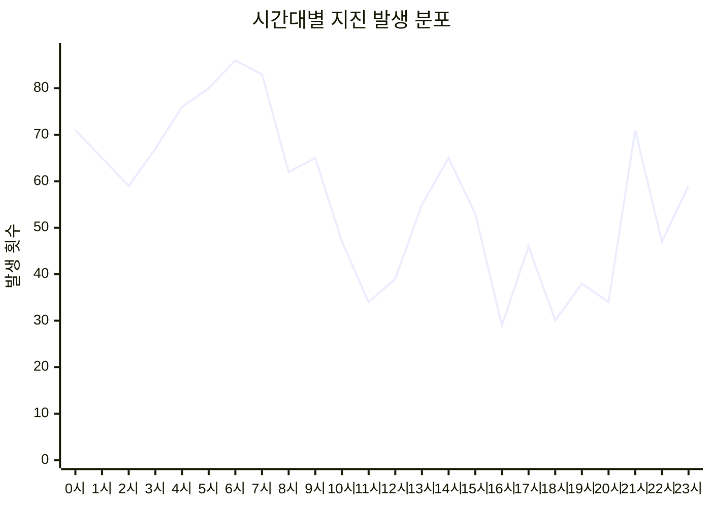

# 시간대별 지진 발생 분포

```mermaid
xychart-beta
    title "시간대별 지진 발생 분포"
    x-axis ["0시", "1시", "2시", "3시", "4시", "5시", "6시", "7시", "8시", "9시", "10시", "11시", "12시", "13시", "14시", "15시", "16시", "17시", "18시", "19시", "20시", "21시", "22시", "23시"]
    y-axis "발생 횟수" 0 --> 88
    line [71, 65, 59, 67, 76, 80, 86, 83, 62, 65, 47, 34, 39, 55, 65, 53, 29, 46, 30, 38, 34, 71, 47, 59]
```

업데이트 시간: 2025-07-04 06:13:17
