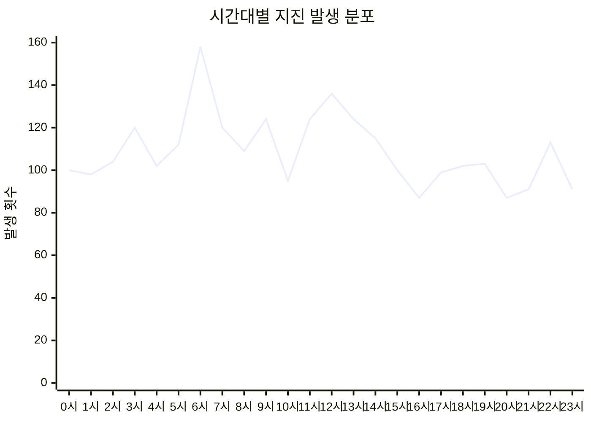

# 시간대별 지진 발생 분포

```mermaid
xychart-beta
    title "시간대별 지진 발생 분포"
    x-axis ["0시", "1시", "2시", "3시", "4시", "5시", "6시", "7시", "8시", "9시", "10시", "11시", "12시", "13시", "14시", "15시", "16시", "17시", "18시", "19시", "20시", "21시", "22시", "23시"]
    y-axis "발생 횟수" 0 --> 160
    line [100, 98, 104, 120, 102, 112, 158, 120, 109, 124, 95, 124, 136, 124, 115, 100, 87, 99, 102, 103, 87, 91, 113, 91]
```

업데이트 시간: 2025-09-18 01:31:35
