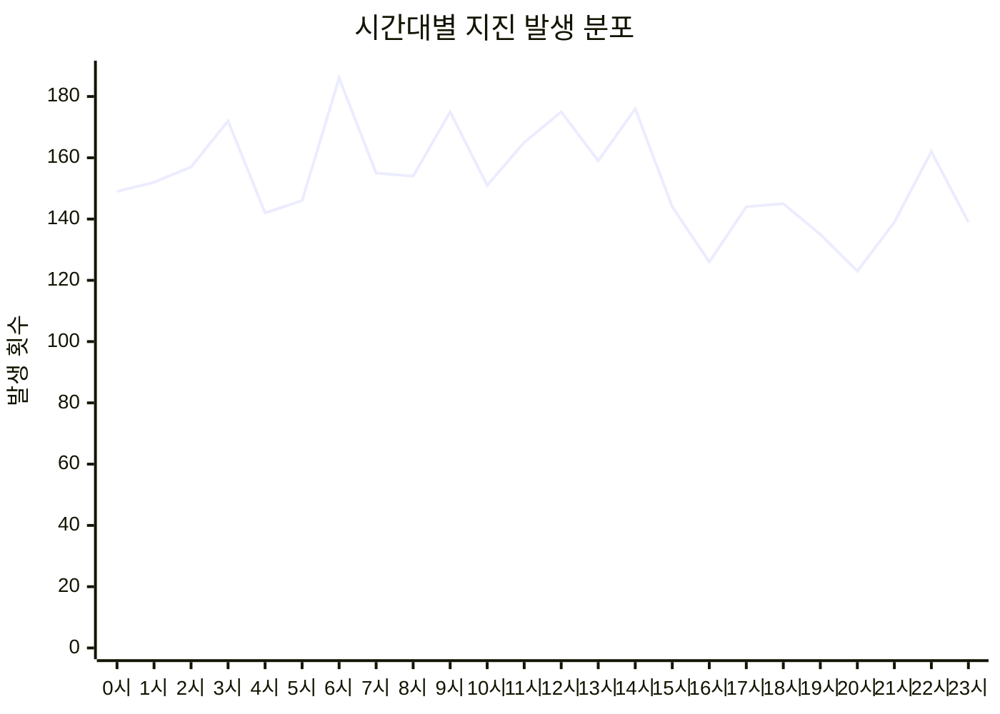

# 시간대별 지진 발생 분포

```mermaid
xychart-beta
    title "시간대별 지진 발생 분포"
    x-axis ["0시", "1시", "2시", "3시", "4시", "5시", "6시", "7시", "8시", "9시", "10시", "11시", "12시", "13시", "14시", "15시", "16시", "17시", "18시", "19시", "20시", "21시", "22시", "23시"]
    y-axis "발생 횟수" 0 --> 188
    line [149, 152, 157, 172, 142, 146, 186, 155, 154, 175, 151, 165, 175, 159, 176, 144, 126, 144, 145, 135, 123, 139, 162, 139]
```

업데이트 시간: 2026-02-18 15:18:57
