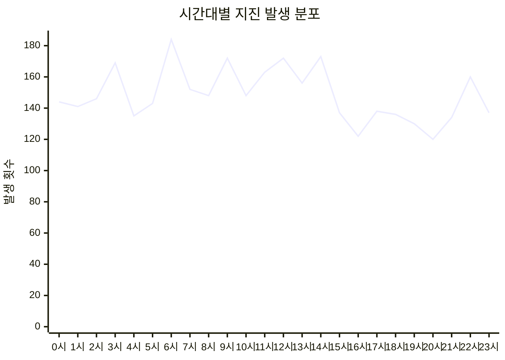

# 시간대별 지진 발생 분포

```mermaid
xychart-beta
    title "시간대별 지진 발생 분포"
    x-axis ["0시", "1시", "2시", "3시", "4시", "5시", "6시", "7시", "8시", "9시", "10시", "11시", "12시", "13시", "14시", "15시", "16시", "17시", "18시", "19시", "20시", "21시", "22시", "23시"]
    y-axis "발생 횟수" 0 --> 186
    line [144, 141, 146, 169, 135, 143, 184, 152, 148, 172, 148, 163, 172, 156, 173, 137, 122, 138, 136, 130, 120, 134, 160, 137]
```

업데이트 시간: 2026-01-26 22:04:56
